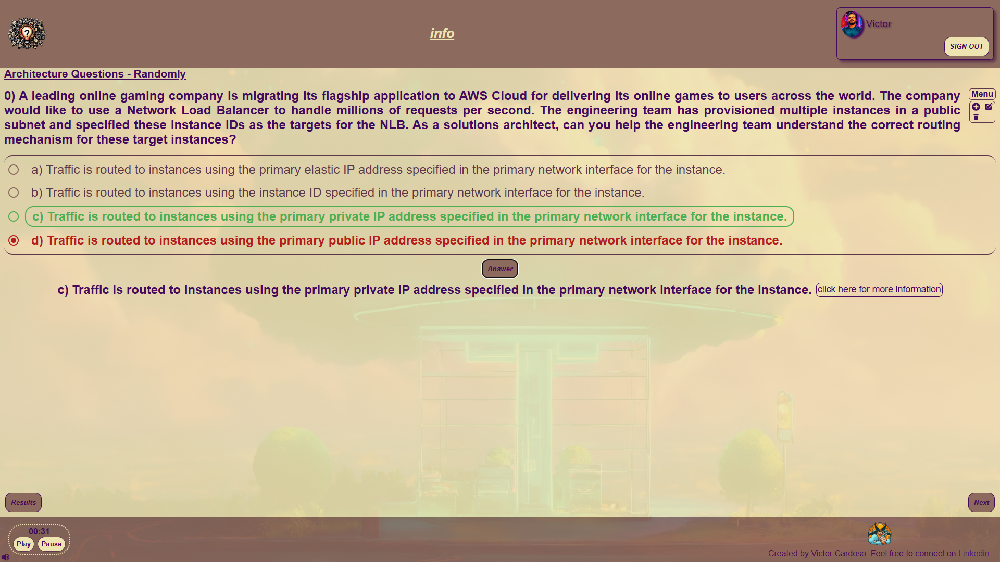

    

# AWS Architecture Questions Project

> ℹ️ **NOTE:** Este repositório foi desenvolvido durante meus estudos de Front-End e Cloud Computing, com o objetivo de aprimorar meus conhecimentos nesses temas. Este projeto estará em constante evolução para melhorar o desempenho e a otimização do código. 

> ℹ️ **NOTE:** This repository was developed during my studies in Front-End and Cloud Computing, with the goal of strengthening my expertise in these areas. The project will continue to evolve, focusing on performance improvements and code optimization.

## ✨ Features
✅ Bem vindos! Este é um projeto com o objetivo de criar uma aplicação em React com temática AWS Cloud Computing, com funcionalidades de verificar as questões certas ou erradas, bem como mostrar a resposta correta com informações detalhadas, medindo o conhecimento sobre arquiteturas da Aws em nível associate. Minha gratidão a Deus pela finalização do projeto.

✅ Welcome! This is a project aimed at creating a React application with an AWS Cloud Computing theme, featuring functionalities to check correct or incorrect answers, as well as display the correct answer with detailed information, measuring knowledge on AWS architectures at the associate level. My gratitude to God for the completion of this project.

<a href="https://architecture-react-cloud-questions.vercel.app/" title="View Project now"> 📟 Click here to view the application</a> 
<a href="https://github.com/VictorSamuraiWol/architecture-aws-1" title="View Repository now"> 📜 Click here to view the repository</a>

## 💻 Technologies used in the project

- [Visual Studio Code](https://code.visualstudio.com/)
- [HTML](https://html.com/) 
- [CSS](https://www.w3.org/Style/CSS/Overview.en.html)
- [JavaScript](https://www.javascript.com/)
- [React](https://react.dev/)
- [React Icons](https://react-icons.github.io/react-icons/)
- [AWS](https://aws.amazon.com/pt/)
- [AWS Icons](https://aws-icons.com/)
- [Json-Server](https://www.npmjs.com/package/json-server)
- [MySQL](https://www.mysql.com/)
- [Microsoft Designer](https://designer.microsoft.com/)
- [Pixabay](https://pixabay.com/pt/)
- [ChatGPT](https://chatgpt.com/)
- [Germini](https://gemini.google.com/app?hl=pt-BR)
- [Lexica](https://lexica.art/)
- [Github](https://github.com/)
- [Github Actions](https://github.com/features/actions)
- [Docker](https://www.docker.com/)
- [Vercel](https://vercel.com/)
- [Trello](https://trello.com/pt-BR)

##  AWS and Oracle Certified in Cloud Computing, Front-End Student 
 

    
    
&nbsp&nbsp&nbspVictor Cardoso 
    &nbsp&nbsp&nbsp
    <a 
        href="https://github.com/VictorSamuraiWol">
        GitHub
    </a>
    &nbsp;|&nbsp;
    <a 
        href="https://www.linkedin.com/in/victor-cardoso-cloud-front/">
        LinkedIn
    </a>
    &nbsp;|&nbsp;
    

 

---

⌨️ with 💚 by [Victor Cardoso](https://github.com/VictorSamuraiWol)
